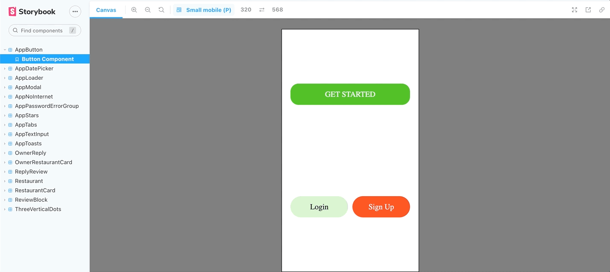

This is a react native app built using typescript for posting reviews on restaurants
Find the same app built in native android using kotliin [here](https://github.com/vibinjoby/Ratings-app-kotlin)

# API

This project uses graphql via apollo client and the backend repo can be found [here](https://github.com/vibinjoby/Ratings-api-nestjs-gql)

# Storybook

The project uses storybook library for developing components and screens in isolation and chromatic for visual regression testing
https://storybook.js.org/docs/react/get-started/introduction

## Web

Run `yarn storybook`



## Mobile


# Unit and E2E testing

## E2E testing using detox

Build the android release using `yarn android:e2e:build`

Run `yarn android:e2e:test` to execute the detox test

| Step-1                         | Step-2                         | Step-3                         | Step-4                         |
| ------------------------------ | ------------------------------ | ------------------------------ | ------------------------------ |
|  |  |  |  |

# Script use case

## Step-1

- Create a new Owner account
- Add a new restaurant by filling all the needed info
- Logout from the app

## Step-2

- Login as a customer
- Search for the restaurant recently created by scrolling to the bottom
- Add a new review
- Logout from the app

## Step-3

- Login as a owner to the newly created account
- Add owner's response to the customer's review by clicking on reply
- Logout from the app

## Step-4

- Login as a admin
- Go to the users page
- Delete the recently created owner user
- Go to the restaurant's page
- Go to the recently created restaurant and open the reviews
- Edit the review of customer and owner
- Delete the review
- Logout of the app


## Unit testing and Linting

Run the script `npm run prettier-check && npm run lint && npm run test -- -u` which will execute all the unit test cases and run linting


## Creating new components

For convenience reasons the project uses template generator to simplify creation of new
components. For example, to generate a new `Button` component run:

`npm run component Button`

This will create a new `Button` directory inside `src/components` with following files:

```
src/components/Button/index.ts
src/components/Button/stories.ts
src/components/Button/styles.ts
```

It will also update `src/stories/index.js` with a newly created component storybook entry.
